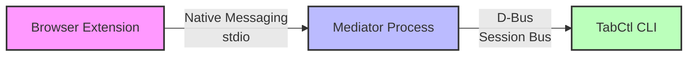
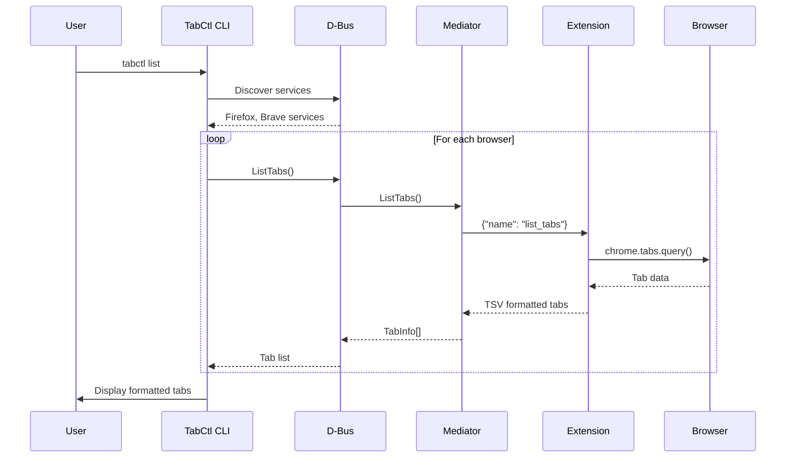
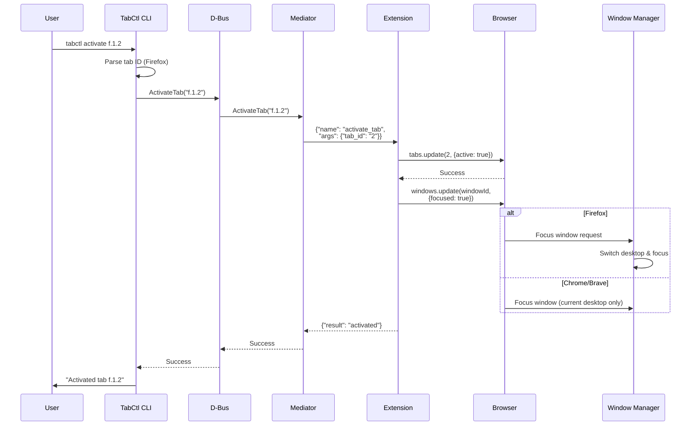

## Overview

TabCtl uses a D-Bus-based architecture to enable command-line control of browser tabs. The system consists of three main components that communicate through well-defined interfaces.

## Component Architecture



## Components

### 1. Browser Extension (`extensions/`)

**Purpose:** Interface with browser's tab API and communicate with mediator.

**Key Files:**
- `background.js` - Main extension logic
- `manifest.json` - Extension configuration

**Responsibilities:**
- Listen for native messaging connections
- Execute tab operations (list, activate, close)
- Format responses in TSV format
- Handle browser-specific APIs (Chrome vs Firefox)

**Communication:**
- **Input:** JSON commands via stdin from mediator
- **Output:** JSON responses via stdout to mediator

### 2. Mediator (`cmd/tabctl-mediator/`)

**Purpose:** Bridge between browser extension (native messaging) and CLI (D-Bus).

**Key Files:**
- `main.go` - Entry point, lifecycle management
- `internal/mediator/mediator.go` - Core orchestration
- `internal/mediator/browser_api.go` - Extension communication
- `internal/mediator/browser_handler.go` - D-Bus interface adapter
- `internal/mediator/transport.go` - Native messaging protocol

**Responsibilities:**
- Register on D-Bus with browser-specific name
- Translate between native messaging and D-Bus protocols
- Handle browser lifecycle (exit when browser closes)
- Log errors to `/tmp/tabctl-mediator.log`

**Communication:**
- **Stdin/Stdout:** Native messaging with browser extension
- **D-Bus:** Service at `dev.slastra.TabCtl.<Browser>`

### 3. CLI (`cmd/tabctl/`)

**Purpose:** User interface for tab control commands.

**Key Files:**
- `main.go` - Entry point
- `internal/cli/*.go` - Command implementations
- `internal/client/browser_manager.go` - Multi-browser orchestration
- `internal/client/dbus_client.go` - D-Bus communication
- `internal/dbus/client.go` - Low-level D-Bus operations

**Responsibilities:**
- Parse command-line arguments
- Discover available browsers via D-Bus
- Route commands to appropriate browser
- Format output (TSV, JSON, simple)

## Data Flow

### List Tabs Example



### Activate Tab Example



## D-Bus Interface

### Service Names
- `dev.slastra.TabCtl.Firefox`
- `dev.slastra.TabCtl.Brave`
- `dev.slastra.TabCtl.Chrome`

### Object Path
`/dev/slastra/TabCtl/Browser/<BrowserName>`

### Interface
`dev.slastra.TabCtl.Browser`

### Methods

```go
type BrowserHandler interface {
    ListTabs() ([]TabInfo, error)
    ActivateTab(tabID string) (bool, error)
    CloseTab(tabID string) (bool, error)
    OpenTab(url string) (string, error)
}
```

### TabInfo Structure

```go
type TabInfo struct {
    ID     string
    Title  string
    URL    string
    Index  int32
    Active bool
    Pinned bool
}
```

## Tab ID Format

Tab IDs encode browser, window, and tab information:

- **Firefox:** `f.<window_id>.<tab_id>`
  - Example: `f.1.2` (window 1, tab 2)
- **Chrome/Brave:** `c.<window_id>.<tab_id>`
  - Example: `c.1874583011.1874583012`

The prefix allows routing commands to the correct browser.

## Native Messaging Protocol

### Message Format

**Request:**
```json
{
  "name": "command_name",
  "args": {
    "arg1": "value1",
    "arg2": "value2"
  }
}
```

**Response:**
```json
{
  "result": "data" | ["array"],
  "error": "error message if failed"
}
```

### Message Framing

Native messaging uses length-prefixed JSON:
1. 4-byte little-endian integer (message length)
2. JSON message body

## Process Lifecycle

### Mediator Startup
1. Browser launches mediator via native messaging
2. Mediator detects browser from command-line args
3. Registers D-Bus service with browser-specific name
4. Logs startup to `/tmp/tabctl-mediator.log` (debug mode only)

### Mediator Shutdown
1. Browser closes → stdin EOF
2. Mediator detects EOF in polling loop
3. Unregisters from D-Bus
4. Process exits cleanly

### Multi-Browser Support
- Each browser gets its own mediator process
- Mediators run independently
- CLI discovers all via D-Bus name listing
- Commands can target specific browser or all

## Directory Structure

```mermaid
graph TD
    A[tabctl/] --> B[cmd/]
    A --> C[internal/]
    A --> D[pkg/]
    A --> E[extensions/]
    A --> F[scripts/]

    B --> B1[tabctl/<br/>CLI entry point]
    B --> B2[tabctl-mediator/<br/>Mediator entry point]

    C --> C1[cli/<br/>Command implementations]
    C --> C2[client/<br/>D-Bus client & browser manager]
    C --> C3[dbus/<br/>D-Bus primitives]
    C --> C4[mediator/<br/>Mediator core logic]
    C --> C5[platform/<br/>OS-specific code]
    C --> C6[utils/<br/>Shared utilities]

    D --> D1[api/<br/>Public interfaces]
    D --> D2[types/<br/>Shared types]

    E --> E1[firefox/<br/>Firefox extension]
    E --> E2[chrome/<br/>Chrome/Brave extension]

    F --> F1[rofi-wmctrl.sh<br/>X11 integration]
    F --> F2[rofi-hyprctl.sh<br/>Hyprland integration]

    style A fill:#f9f,stroke:#333,stroke-width:3px
    style B fill:#bbf,stroke:#333,stroke-width:2px
    style C fill:#bfb,stroke:#333,stroke-width:2px
    style D fill:#fbf,stroke:#333,stroke-width:2px
    style E fill:#ffb,stroke:#333,stroke-width:2px
    style F fill:#bff,stroke:#333,stroke-width:2px
```



## Error Handling

### Connection Errors
- D-Bus registration conflicts logged and handled
- Browser disconnection triggers clean shutdown
- Network errors bubble up to CLI with context

### Command Errors
- Invalid tab IDs return error to CLI
- Browser API failures logged in mediator
- Timeout protection on all operations

## Security Considerations

1. **Native Messaging:** Only registered extensions can launch mediator
2. **D-Bus:** Session bus only (user isolation)
3. **No Network:** All communication is local IPC
4. **No Elevated Privileges:** Runs as user process
5. **Minimal Permissions:** Extensions use only necessary browser APIs

## Performance

- **D-Bus:** ~1ms latency for local calls
- **Tab List:** <50ms for 100 tabs
- **Tab Activation:** <100ms including window focus
- **Memory:** ~10MB per mediator process
- **CPU:** Near zero when idle

## Window Focus Behavior

The `activate` command's window focusing behavior varies by browser:

### Firefox
Firefox's `browser.windows.update()` API with `{focused: true}` triggers automatic desktop switching:

```javascript
// Firefox extension calls
browser.windows.update(windowId, {focused: true})
```

Modern window managers (KDE, GNOME, etc.) respond by:
1. Switching to the virtual desktop containing the window
2. Raising the window to the top
3. Giving it keyboard focus

### Chrome/Chromium/Brave
Chrome-based browsers have more limited window focus capabilities:
- `chrome.windows.update()` focuses the window if on current desktop
- Does not trigger automatic desktop/workspace switching
- User must manually switch to the appropriate desktop first

This difference is due to browser API implementations, not TabCtl limitations.

## Future Enhancements

- WebSocket support for remote control
- Tab search and filtering in mediator
- Batch operations optimization
- Extension UI for status indication
- Persistent mediator mode for faster operations
