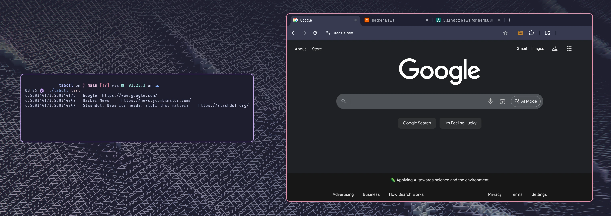
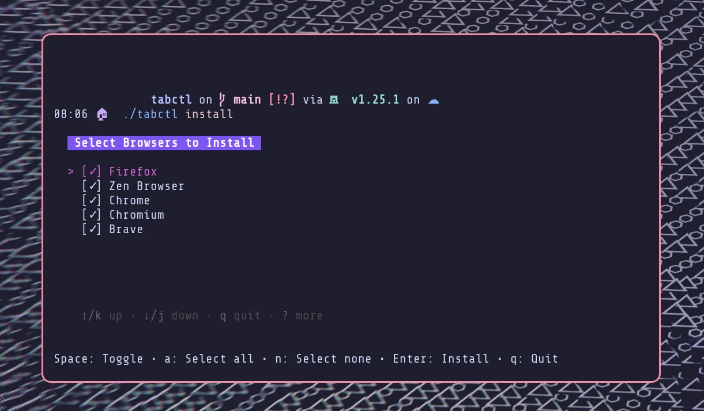

**Command-line browser tab control with seamless desktop integration.**

TabCtl enables powerful command-line control of browser tabs across Firefox and Chrome-based browsers. Built for developers and power users who prefer keyboard-driven workflows.



## Features

- **Universal Browser Support** - Works with Firefox, Chrome, Chromium, and Brave browsers
- **D-Bus Architecture** - Secure local communication without network dependencies
- **Desktop Integration** - Automatic window focus and workspace switching
- **Rofi Integration** - Lightning-fast fuzzy search across all open tabs
- **Privacy Focused** - No data collection, all operations remain local

## Quick Start

### Installation

#### Arch Linux (AUR)

```bash
# Install from AUR
yay -S tabctl
# or
paru -S tabctl

# Set up native messaging
tabctl install
```

#### From Source

```bash
# Clone and build
git clone https://github.com/slastra/tabctl
cd tabctl
go build -o tabctl ./cmd/tabctl
go build -o tabctl-mediator ./cmd/tabctl-mediator

# Install native messaging
./tabctl install
```

### Setup

```bash
# Install native messaging host
tabctl install

# Load the browser extension
# Firefox: Install from extensions/firefox/tabctl-firefox-1.1.2.xpi
# Chrome/Brave: Load unpacked from extensions/chrome/
```



### Basic Usage

```bash
# List all open tabs
tabctl list

# Activate a specific tab
tabctl activate f.1.234

# Close multiple tabs
tabctl close f.1.234 f.1.235

# Query tabs by title or URL
tabctl query github
```

## Rofi Integration

TabCtl includes powerful [Rofi](https://github.com/davatorium/rofi) integration for visual tab management:

```bash
# X11 with wmctrl
scripts/rofi-wmctrl.sh

# Wayland with Hyprland
scripts/rofi-hyprctl.sh
```

The Rofi integration provides instant fuzzy search across all tabs with automatic desktop/workspace switching when activating tabs.

## Documentation

- [Architecture Overview](./ARCHITECTURE.html) - Technical design and implementation details
- [Privacy Policy](./PRIVACY-POLICY.html) - Our commitment to your privacy
- [GitHub Repository](https://github.com/slastra/tabctl) - Source code and issue tracking

## Contributing

TabCtl is open source software released under the MIT License. Contributions are welcome! Please see our [GitHub repository](https://github.com/slastra/tabctl) for development guidelines and issue tracking.

## Support

- **Issues**: [GitHub Issues](https://github.com/slastra/tabctl/issues)
- **Discussions**: [GitHub Discussions](https://github.com/slastra/tabctl/discussions)
- **Latest Release**: [v1.1.0](https://github.com/slastra/tabctl/releases/latest)
