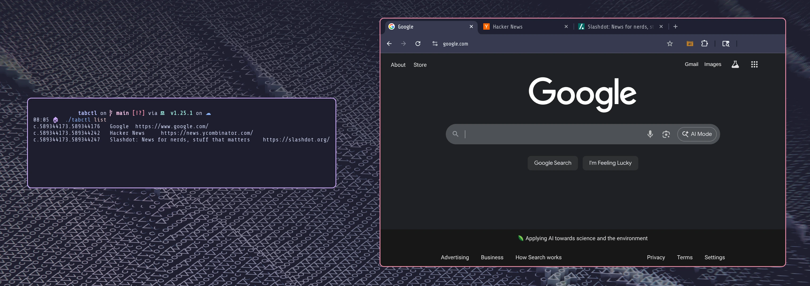
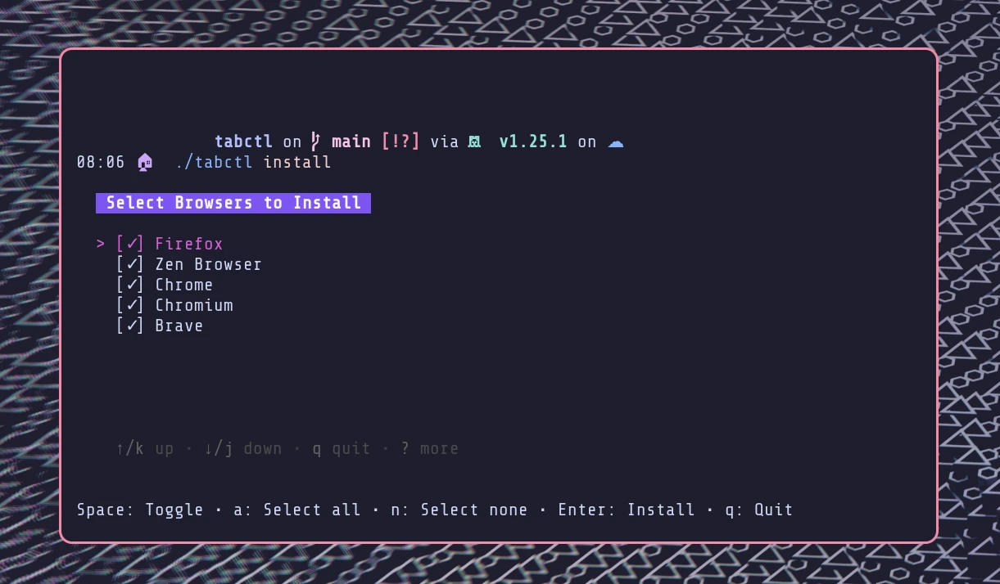

**Command-line browser tab control with seamless desktop integration.**

TabCtl enables powerful command-line control of browser tabs across Firefox and Chrome-based browsers. Built for developers and power users who prefer keyboard-driven workflows. Currently, for Linux only.



## Features

- **Universal Browser Support** - Works with Firefox, Zen, Chrome, Chromium, Brave, Brave Origin, and Helium
- **D-Bus Architecture** - Secure local communication without network dependencies
- **Desktop Integration** - Automatic window focus and workspace switching
- **Rofi Integration** - Lightning-fast fuzzy search across all open tabs
- **Privacy Focused** - No data collection, all operations remain local

## Quick Start

### Installation

#### Arch Linux (AUR)

```bash
# Install from AUR
yay -S tabctl
# or
paru -S tabctl
```

#### From Source

```bash
# Clone and build. Both binaries land in build/
git clone https://github.com/slastra/tabctl
cd tabctl
make build
```

### Setup

```bash
# Install native messaging host
./build/tabctl install
```



### Browser Extensions

Install the extension for your browser:

- **Firefox based**: [Install from Mozilla Add-ons](https://addons.mozilla.org/en-US/firefox/addon/tabctl1/)
- **Chrome based**: [Install from Chrome Web Store](https://chromewebstore.google.com/detail/tabctl/baomblllgemcgbignhpbipgiofmjdhpn)
- **Brave / Brave Origin / Chromium / Helium**: Use the Chrome Web Store link above

Or install manually from source:
- Firefox/Zen: `extensions/firefox/`
- Chrome/Brave: Load unpacked from `extensions/chrome/`

### Basic Usage

```bash
# List all open tabs
tabctl list

# Activate a specific tab
tabctl activate firefox.1.234

# Close multiple tabs
tabctl close firefox.1.234 firefox.1.235

# Open URLs in new tabs
tabctl open https://github.com

# Find tabs by title or URL
tabctl list | grep -i github

# JSON output for scripting
tabctl list --format json

# Check the extension and command-line tool are on matching versions
tabctl status
```

## Rofi Integration

TabCtl includes powerful [Rofi](https://github.com/davatorium/rofi) integration for visual tab management:

```bash
# X11 with wmctrl
scripts/rofi-tabctl-wmctrl.sh

# Wayland with Hyprland (favicons)
scripts/rofi-tabctl-hyprland.sh
```

AUR installs ship both scripts in `/usr/share/tabctl/scripts/`.

The Rofi integration provides instant fuzzy search across all tabs with automatic desktop/workspace switching when activating tabs. In the Hyprland script, **Enter** switches to the highlighted tab and **Ctrl+w** closes it (reopening the menu so you can clear several at once).

## Documentation

- [Architecture Overview](./ARCHITECTURE.html) - Technical design and implementation details
- [Privacy Policy](./PRIVACY-POLICY.html) - Our commitment to your privacy
- [GitHub Repository](https://github.com/slastra/tabctl) - Source code and issue tracking

## Contributing

TabCtl is open source software released under the MIT License. Contributions are welcome! Please see our [GitHub repository](https://github.com/slastra/tabctl) for development guidelines and issue tracking.

## Support

- **Issues**: [GitHub Issues](https://github.com/slastra/tabctl/issues)
- **Discussions**: [GitHub Discussions](https://github.com/slastra/tabctl/discussions)
- **Latest Release**: [GitHub Releases](https://github.com/slastra/tabctl/releases/latest)

## Acknowledgments

TabCtl was inspired by [BroTab](https://github.com/balta2ar/brotab), rewritten in Go with a D-Bus architecture and a Manifest v3 Chrome extension.
