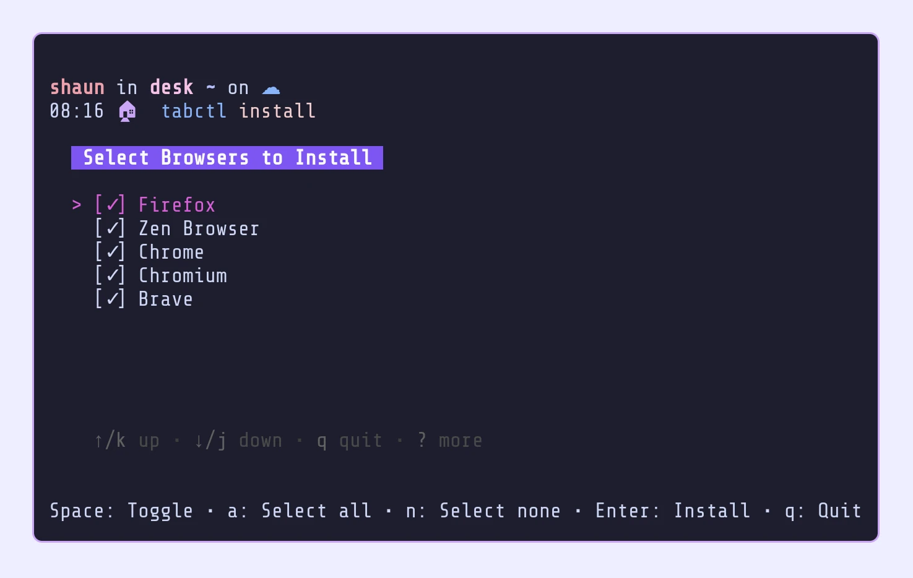

# TabCtl

Control your browser tabs from the command line.


## Quick Links
- [GitHub Repository](https://github.com/slastra/tabctl)
- [Architecture](./ARCHITECTURE.html)
- [Privacy Policy](./PRIVACY-POLICY.html)

## Usage

TabCtl provides command-line control of browser tabs across Firefox and Chrome-based browsers using D-Bus IPC.

### Basic Commands
```bash
# List all tabs
tabctl list

# Activate a specific tab
tabctl activate f.1.2        # Firefox tab
tabctl activate c.1234.5678  # Chrome/Brave tab

# Close tabs
tabctl close f.1.3 f.1.4
```

### Rofi Integration
TabCtl includes scripts for [Rofi](https://github.com/davatorium/rofi), a window switcher and application launcher, enabling quick tab switching with automatic desktop/workspace switching.

## Installation



See the [README on GitHub](https://github.com/slastra/tabctl#installation) for detailed installation instructions.